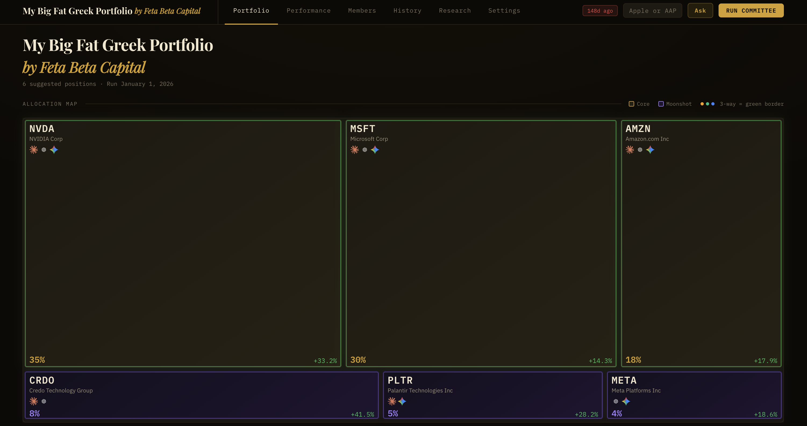
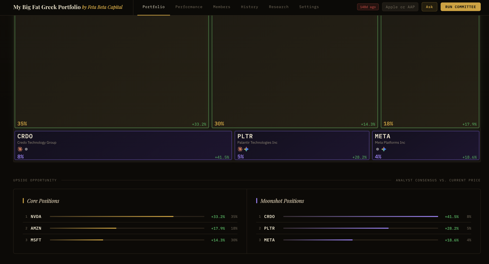
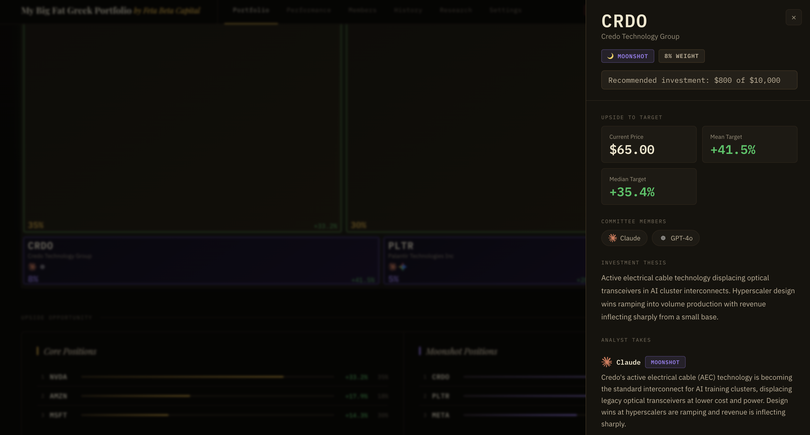
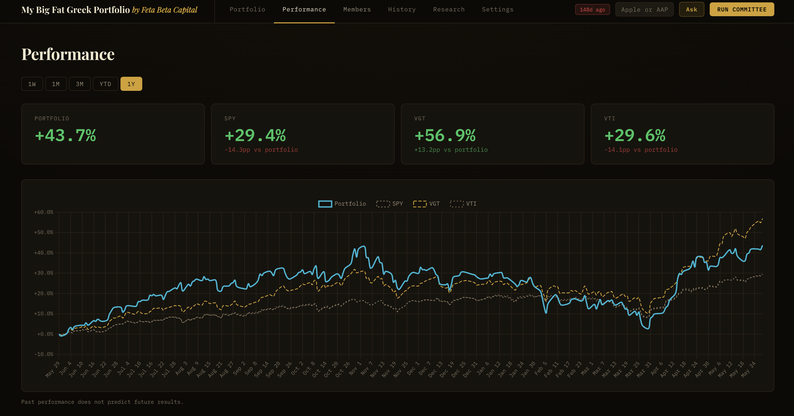
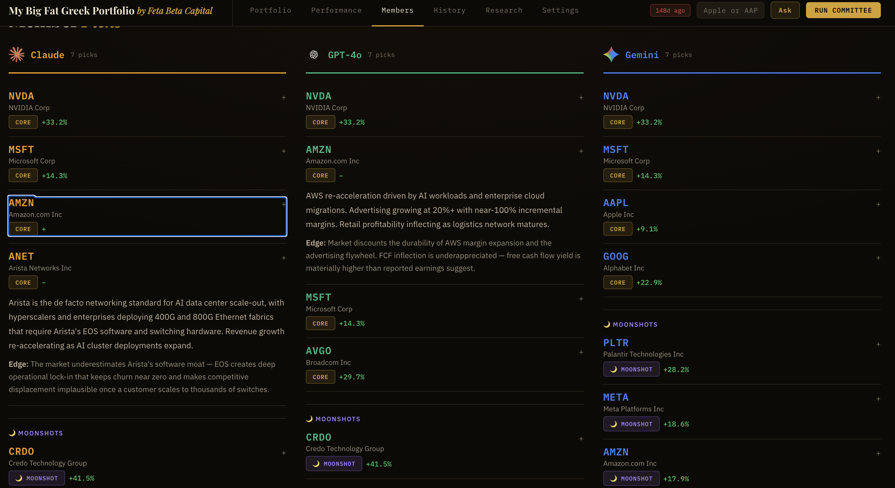

# My Big Fat Greek Portfolio

An AI investment committee that debates stock picks. Three models — Claude, Gemini, and GPT — each independently research the market, nominate a portfolio, and get cross-examined on individual tickers. The app aggregates their picks into a consensus portfolio and tracks performance over time.

Built as a showcase of how I use LLMs iteratively to ship a real product. See [`docs/planning/`](docs/planning/) for the PRD and design plans that drove each major iteration.

## Screenshots

**Portfolio** — treemap weighted by cross-member conviction, with upside-to-target signal strip




**Stock detail** — per-ticker drawer with committee takes, analyst consensus, and recommended allocation



**Performance** — portfolio vs. SPY / VGT / VTI over a rolling 1-year window



**Committee members** — each model's independent picks with conviction and variant perception



## What it does

- **Committee runs** — all three models screen a universe of stocks, do independent macro research, and nominate picks with conviction levels and variant perception theses
- **Portfolio view** — treemap of the consensus portfolio weighted by cross-member conviction
- **Advisor** — ask the committee for an opinion on any ticker; responses are cached and logged
- **Performance** — portfolio vs. benchmarks (SPY, VGT, VTI) over a rolling 1-year window
- **Exclusions** — live filtering of tickers or sectors from the portfolio, applied without re-running

## Getting started

### Demo mode (no API keys needed)

```bash
uv run uvicorn api:app --reload --port 8000
```

If no API keys are configured, the app seeds itself from the example data in `data/*.example.*` and runs in read-only mode. Live committee runs and advisor queries are disabled.

### Full mode

Create a `.env` file:

```
ANTHROPIC_API_KEY=...
OPENAI_API_KEY=...
GOOGLE_API_KEY=...
```

Then:

```bash
uv run uvicorn api:app --reload --port 8000
```

## Tech stack

- **Backend** — FastAPI, `anthropic`, `openai`, `google-genai`, `yfinance`
- **Frontend** — vanilla JS, custom CSS design system, Chart.js, no framework
- **Data** — yfinance for screening and performance; AI APIs for research and picks
- **Legacy** — Streamlit prototype in `scripts/app.py`

## Project structure

```
api.py              FastAPI app and all endpoints
src/                backend logic
  committee/        one module per AI member + aggregator
  advisor.py        per-ticker committee opinion
  screener.py       universe screening via yfinance
  performance.py    portfolio vs benchmark returns
  runner.py         full committee run orchestration
  demo.py           demo mode seeding and detection
static/             frontend (HTML, CSS, JS)
data/               caches, run history, exclusions
  *.example.*       seed data for demo mode
scripts/            one-off run and benchmark scripts
docs/
  planning/         PRD, design plans, prototype
  screenshots/      product screenshots
  quorum-pitch.*    product one-pager (HTML + PDF)
tests/
```

## Planning process

This project was built iteratively using Claude Code. The [`docs/planning/`](docs/planning/) folder contains the PRD and design documents that shaped each major phase — a real record of how I work with LLMs to go from idea to shipped product.
